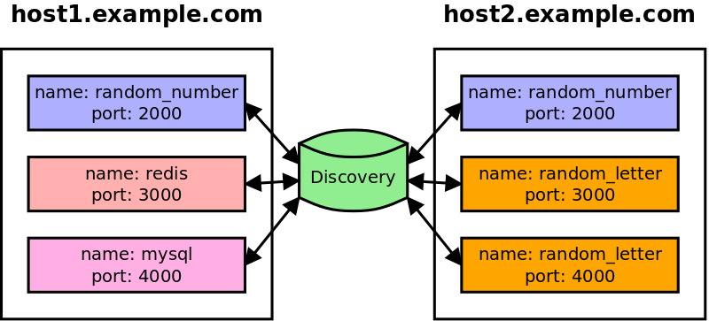

# Rudimentary Application Discovery

This project is a rudimentary Discovery service for illustrating how the whole Discovery process works.
This project will accompany a book I'm currently writing.

Application Discovery is the process of finding a provider of a service (host:port) using just the providers name.
Providers register themselves with a Discovery service, giving a name and a host and a port.
The Discovery service needs to make sure the Providers are still healthy, either by making a request to the Providers, or with the Providers making a request to Discovery (this example does the prior).
Health checks are performed using checks at regular intervals.

Providers need to gracefully tell the Discovery service when they're ending to prevent it from receiving requests after dyinig and before a health poll.



## Usage

* Clone this repository
* Install the dependencies `npm install`
* Start the Discovery Service `./server.js 32000 10000 4000`
* Start a Client Provider `./client-provider.js 2001 localhost:32000`
* Start another Client Provider `./client-provider.js 2002 localhost:32000`
* Start a Client Consumer and wait a few seconds `./client-consumer.js localhost:32000`
* Notice how the Consumer gets data from both Providers
* Kill one of the Client Providers (Ctrl+C)
* Notice how the Consumer gets data from one Provider

### Server

This creates an instance of the Discovery server.
It will listen for messages on a `port`.
It will reach out to every known service at the interval of `poll_timer` milliseconds, expecting a status code below 400.
It will wait as long as `threshold` for a response before assuming the process is dead.

```shell
# ./server.js <port=32000> <poll_timer=10000> <threshold=4000>
./server.js 32000 10000 4000
```

#### Server Endpoints

##### List All Services

Gets a list of all instances in the Discovery server pools, keyed by service name.

**Request**

```
GET /services
```

**Response**

```json
{
  "random_number": [
    {
      "id": "ec110bf1-0227-470d-9586-33e2d469284c",
      "host": "localhost",
      "port": 9001
    },
    {
      "id": "84c91ec7-4ba9-4867-8cc8-dad72236a232",
      "host": "localhost",
      "port": 9002
    }
  ],
  "database": [
    {
      "id": "6fbd6f56-03e0-45bd-8529-42319d550f70",
      "host": "localhost",
      "port": 9011
    },
    {
      "id": "4f651615-b19d-444d-a7d2-ed0d524e954d",
      "host": "localhost",
      "port": 9012
    }
  ]
}
```

##### Register Instance

Adds an instance to the Discovery service pool.

**Request**

```
POST /services/{service_name}
```

```json
{
  "host": "localhost",
  "port": 9021
}
```

**Response**

```json
{
  "id": "17a3ac38-4630-4424-b21f-851725ef2a0a",
  "host": "localhost",
  "port": 9021
}
```

##### De-Register Instance

Tells the Discovery service that you wish to remove an instance from the service pool.
Services will automatically be removed if they stop responsing, but you should always manually deregister when you know a process is going to end.

**Request**

```
DELETE /services/{service_name}/{instance_id}
```

**Response**

```json
{
  "id": "17a3ac38-4630-4424-b21f-851725ef2a0a",
  "host": "localhost",
  "port": 9021
}
```


### Clients

```shell
# ./client-provider.js <client_port> <discovery_address=localhost:32000>
./client-provider.js 2001 localhost:32000 # Ctrl+C later
./client-provider.js 2002 localhost:32000

# ./client-consumer.js <discovery_address=localhost:32000>
./client-consumer.js localhost:32000
```

#### Client Provider Endpoints

This service will respond with a random number.
It will also respond with its PID and Discovery instance ID.

##### Get Awesome Data

**Request**

```
GET /data
```

**Response**

```json
{
  "data": 12345678,
  "debug": {
    "pid": 20001,
    "discovery": "ec110bf1-0227-470d-9586-33e2d469284c"
  }
}
```

##### Health Check

**Request**

```
GET /health
```

**Response**

```
ok
```

#### Client Consumer

This process doesn't have any endpoints.
It will randomly ask for data from a Provider.
